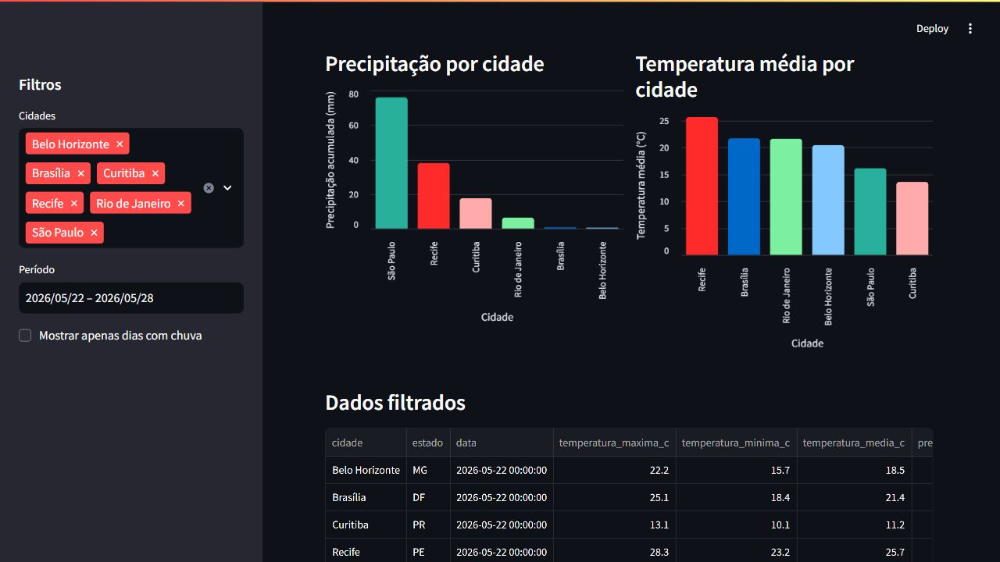

# dashboard-clima-streamlit

Dashboard simples em Streamlit para visualizar dados de clima tratados no projeto `etl-clima-python-sqlite`.

## Dashboard Online

https://dashboard-clima.streamlit.app/

O app está publicado no Streamlit Community Cloud. A ideia continua sendo simples: mostrar os dados de clima de forma visual, sem transformar o projeto em algo grande demais.

O dashboard é compatível com a base que junta histórico recente e previsão futura, identificando cada linha pela coluna `tipo_dado`.

A ideia é mostrar KPIs, filtros e gráficos a partir de uma base pequena, mantendo o projeto simples e fácil de entender.

## Objetivo

- criar uma visualização simples para dados de clima;
- mostrar indicadores por cidade e período;
- permitir filtrar dados históricos e dados de previsão;
- permitir filtros básicos;
- exibir gráficos e uma tabela com os dados filtrados;
- praticar Streamlit em um contexto de dados.

## Fonte Dos Dados

O arquivo usado pelo dashboard está em:

```text
data/clima_tratado.csv
```

Ele foi gerado a partir deste projeto:

https://github.com/ypernambuco/etl-clima-python-sqlite

A amostra é pequena de propósito. O foco aqui é visualizar os dados de forma simples, sem depender de uma base grande ou de uma integração mais complexa.

A base atual contém histórico recente dos últimos 7 dias e previsão futura. O campo `tipo_dado` permite separar `historico` e `previsao` nos filtros e nos gráficos. Se a coluna não existir em uma base antiga, o dashboard continua abrindo e considera os dados como `previsao`.

## Como Rodar

Crie e ative um ambiente virtual:

```bash
python -m venv .venv
```

No Windows:

```powershell
.venv\Scripts\activate
```

Instale as dependências:

```bash
python -m pip install -r requirements.txt
```

Execute o dashboard:

```bash
streamlit run app.py
```

## Deploy

Este dashboard está publicado no Streamlit Community Cloud usando este repositório do GitHub.

Configuração usada:

- arquivo principal: `app.py`
- branch: `main`
- Python configurado nas opções avançadas do Streamlit Cloud

O projeto também mantém um arquivo `runtime.txt`. A versão do Python foi ajustada nas configurações avançadas do Streamlit Cloud para deixar o deploy compatível com as dependências.

## O Que O Dashboard Mostra

- temperatura média no período;
- maior e menor temperatura;
- precipitação acumulada;
- quantidade de dias com chuva;
- comparação entre cidades;
- evolução diária da temperatura;
- separação entre histórico e previsão;
- tabela com os dados filtrados.

## Screenshots

### Visão geral


O print principal mostra o dashboard funcionando com filtros, KPIs e o gráfico de temperatura. Ele fica logo depois da seção "O Que O Dashboard Mostra" porque ajuda a visualizar o resultado antes de entrar na estrutura do projeto.

### Gráficos e tabela



Este segundo print mostra os gráficos complementares e a tabela filtrada. A ideia é deixar a evidência visual completa sem exagerar na quantidade de imagens.

## Estrutura

```text
dashboard-clima-streamlit/
|-- assets/
|   |-- screenshots/
|   |   |-- dashboard.png
|   |   |-- tabela-dados.png
|-- data/
|   |-- clima_tratado.csv
|-- app.py
|-- README.md
|-- requirements.txt
```

## Aprendizados

Neste projeto, pratiquei:
- criação de dashboard com Streamlit;
- leitura de CSV com pandas;
- uso de filtros por cidade e período;
- criação de KPIs simples;
- exibição de gráficos e tabelas;
- organização básica de um projeto visual.

Também foi útil separar este dashboard do ETL. Assim, o projeto fica focado só na parte de visualização dos dados.

## Limitações

O projeto ainda tem algumas limitações:

- usa uma amostra pequena de dados;
- depende dos dados gerados pelo ETL;
- não atualiza automaticamente sozinho sem novo pipeline;
- lê um CSV local em vez de conectar direto ao SQLite;
- os filtros ainda são simples;
- não possui autenticação;
- não possui testes automatizados.

O objetivo foi manter o dashboard simples e fácil de explicar.

## Próximos Passos

- conectar diretamente ao SQLite do projeto de ETL;
- adicionar opção de upload de CSV;
- incluir mais cidades ou períodos maiores;
- adicionar uma página simples explicando a origem dos dados.
