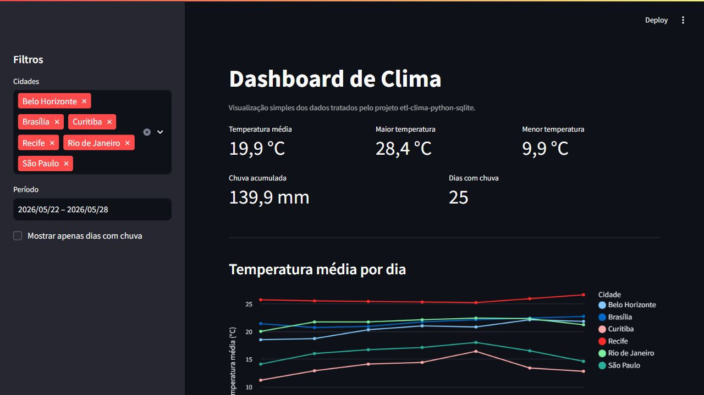

# dashboard-clima-streamlit

Dashboard simples em Streamlit para visualizar dados de clima tratados no projeto `etl-clima-python-sqlite`.

A ideia é mostrar indicadores básicos, filtros e gráficos a partir de uma base pequena, sem complicar a estrutura.

## Objetivo

- criar uma visualização simples para dados de clima;
- mostrar KPIs por período e cidade;
- permitir filtros básicos;
- exibir gráficos e tabela detalhada;
- praticar Streamlit em um contexto de dados.

## Fonte Dos Dados

O arquivo usado pelo dashboard está em:

```text
data/clima_tratado.csv
```

Ele foi gerado a partir do projeto:

https://github.com/ypernambuco/etl-clima-python-sqlite

A amostra é pequena de propósito, só para deixar o dashboard fácil de rodar e entender.

## Como Rodar

Crie e ative um ambiente virtual:

```bash
python -m venv .venv
```

No Windows:

```powershell
.venv\Scripts\activate
```

Instale as dependências:

```bash
python -m pip install -r requirements.txt
```

Execute o dashboard:

```bash
streamlit run app.py
```

## O Que O Dashboard Mostra

- temperatura média no período;
- maior e menor temperatura;
- precipitação acumulada;
- quantidade de dias com chuva;
- comparação entre cidades;
- evolução diária da temperatura;
- tabela com os dados filtrados.

## Screenshot



## Estrutura

```text
dashboard-clima-streamlit/
|-- assets/
|   |-- screenshots/
|-- data/
|   |-- clima_tratado.csv
|-- app.py
|-- README.md
|-- requirements.txt
```

## Limitações

- usa uma amostra pequena de dados;
- não atualiza automaticamente a base;
- ainda lê CSV local em vez de conectar direto ao SQLite;
- não possui autenticação nem publicação em cloud;
- não tem testes automatizados.

Essas limitações fazem parte do escopo atual. O foco é ter um dashboard simples, útil e fácil de explicar.

## Próximos Passos

- conectar diretamente ao SQLite do projeto de ETL;
- adicionar opção de upload de CSV;
- publicar no Streamlit Community Cloud;
- incluir mais cidades ou períodos maiores;
- adicionar uma página simples explicando a origem dos dados.
